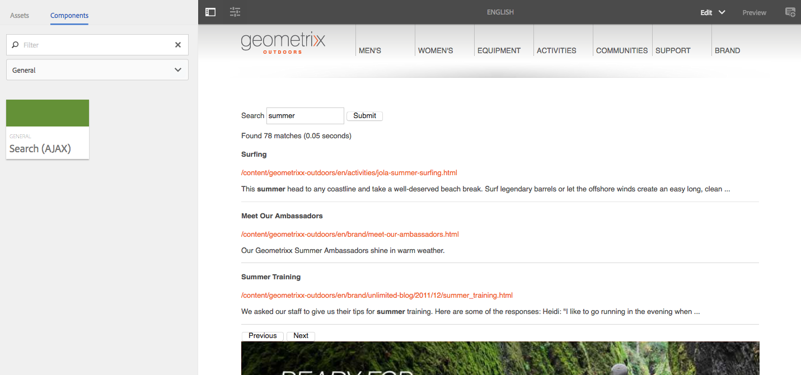

# AEM Ajax Search

This project contains two main elements:
* A servlet to perform full-text JCR searches
* A search component that invokes the servlet using AJAX

## The Servlet

The servlet leverages the foundation [Search](https://docs.adobe.com/docs/en/aem/6-1/ref/javadoc/com/day/cq/wcm/foundation/Search.html) 
service to perform the full text search through the JCR. The `AbstractSearchServlet` provides the search 
functionality and some display logic, whilst the sample implementation `GeoSiteSearchServlet` provides the 
abstract class with the path to search, the default page size and the JSON representation of a search hit.

The search query uses the foundation component implementation so the following query parameters can be used:

| Parameter | Description |
| -------- | ---------- |
| q        | the search query |
| start    | used to navigate the result pages by giving the start index |
| tag      | constraint results to content that matches given tags |
| mimeType | constraint results to content with specific mime type |
| from/to  | constraint results to content last modified within the given "from" and "to" dates |

Additionally, the following parameter has been implemented to override the page size:

Parameter | Description
--------- | ----------
pageSize | defines the page size to use (custom)

Example requests:
```
http://localhost:4502/bin/geometrixx/search/site?q=summer
http://localhost:4502/bin/geometrixx/search/site?q=summer&start=11
http://localhost:4502/bin/geometrixx/search/site?q=summer&start=11&pageSize=20
http://localhost:4502/bin/geometrixx/search/site?q=summer&start=11&tag=geometrixx-outdoors:season/summer
```

> Note: this servlet does not support partial matches, resource type filters or sorting. 
> To cater for more complex searches, you must use the [QueryBuilder](https://docs.adobe.com/docs/en/aem/6-1/develop/search/querybuilder-api.html) and create your own Query from predicates.

## The Component



This is a simple component that allows authors to plug in two properties: endpoint and page size.
The endpoint should match the path of the servlet defined (i.e. /bin/geometrixx/search).

When a user enters a query, an HTTP request is sent to the search servlet and the results are displayed using [Handlebars](http://handlebarsjs.com/).
It also has support for pagination (next & previous), which will trigger subsequent calls to the servlet to fetch the rest of the results.

> This component is only meant to demonstrate the capabilities of the servlet - there's plenty more ways to use it.

## Building

This project uses Maven for building. Common commands:

From the root directory, run ``mvn -PautoInstallPackage clean install`` to build the bundle and content package and install to a CQ instance.

